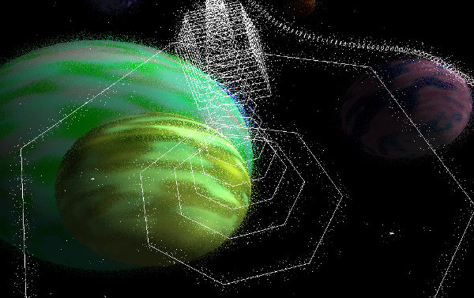
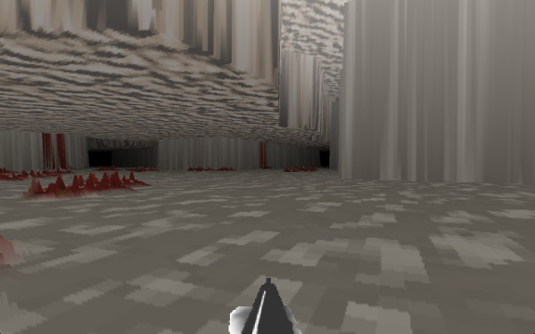
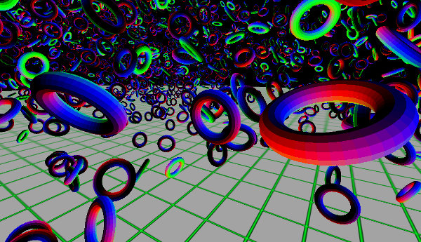

Math
====

Vectors {#vectors}
-------

Amulet has built-in support for 2, 3 or 4 dimensional vectors. Vectors
are typically used to represent things like position, direction or
velocity in 2 or 3 dimensional space. Representing RGBA colors is
another common use of 4 dimensional vectors.

In Amulet vectors are immutable. This means that once you create a
vector, its value cannot be changed. Instead you need to construct a new
vector.

### Constructing vectors

To construct a vector use one of the functions `vec2`, `vec3` or `vec4`.
A vector may be constructed by passing its components as separate
arguments to one of these functions, for example:

~~~ {.lua}
local velocity = vec3(1, 2, 3)
~~~

Passing a single number to a vector constructor will set all components
of the vector to that value. For example:

~~~ {.lua}
local origin = vec2(0)
~~~

sets `origin` to the value `vec2(0, 0)`.

It's also possible to construct a vector from a combination of other
vectors and numbers. The new vector's components will be taken from the
other vectors in the order they are passed in. For example:

~~~ {.lua}
local bottom_left = vec2(0)
local top_right = vec2(10, 100)
local rect = vec4(bottom_left, top_right)
~~~

sets `rect` to `vec4(0, 0, 10, 100)`

### Accessing vector components

There are multiple ways to access the components of a vector. The first
component can be accessed using any of the fields `x`, `r` or `s`; the
second using any of the fields `y`, `g` or `t`; the third using any of
the fields `z`, `b` or `p`; and the fourth using any of the fields `w`,
`a` or `q`. Here are some examples:

~~~ {.lua}
local color = vec4(0.1, 0.3, 0.7, 0.8)
print(color.r..", "..color.g..", "..color.b..", "..color.a)
local point = vec2(5, 2)
print("x="..point.x..", y="..point.y)
~~~

A vector's components can also be accessed with 1-based integer indices.

Vectors support the Lua length operator (`#`), which returns the number
of components of the vector (not its magnitude). This allows for
iterating through the components of a vector of unknown size, for
example:

~~~ {.lua}
local v = vec3(10, 20, 30)
for i = 1, #v do
    print(position[i])
end
~~~

### Swizzle fields

Another way to construct vectors is to recombine the components of an
existing vector using *swizzle fields*, which are special fields whose
names consist of a combination of any of the component field characters. A new
vector containing the named components will be returned. For example:

~~~ {.lua}
local dir = vec3(1, 2, 3)
print(dir.xy)
print(dir.rggb)
print(dir.zzys)
~~~

Running the above code results in the following output:

~~~ {.console}
vec2(1, 2)
vec4(1, 2, 2, 3)
vec4(3, 3, 2, 1)
~~~

**Note:**
You can pass vectors, matrices and quaternions directly to `print` or
other functions that expect strings and they will be formatted
appropriately.

### Vector update syntax

Although you can't directly set the components of a vector, Amulet
provides some syntactic sugar to make it easier to create a new vector
from an existing vector that has only some fields modified. Say, for
example, you had a 3 dimensional vector, `v1`, and you wanted to create
a new vector, `v2`, that had the same components as `v1`, except for the
y component, which you'd like to be 10. One way to do this would be to
write:

~~~ {.lua}
v2 = vec3(v1.x, 10, v1.z)
~~~

but Amulet also allows you to write:

~~~ {.lua}
v2 = v1{y = 10}
~~~

You can use this syntax to "update" multiple components and it also
supports swizzle fields. For example:

~~~ {.lua}
local v = vec4(1, 2, 3, 4)
v = v{x = 5, ba = vec2(6)}
~~~

This would set `v` to `vec4(5, 2, 6, 6)`.

If the values of a swizzle field are going to be updated to the same
value (as with `ba` above), you can just set the field to the value
instead of constructing a vector. So the above could also have been
written as:

~~~ {.lua}
v = v{x = 5, ba = 6}
~~~

### Vector arithmetic

You can do arithmetic with vectors using the standard operators `+`,
`-`, `*` and `/`. If both operands are vectors then they should have the
same size and the operation is applied in a component-wise fashion,
yielding a new vector of the same size. If one operand is a number then
the operation is applied to each component of the vector, yielding a new
vector of the same size as the vector operand. For example:

~~~ {.lua}
print(vec2(3, 4) + 1)
print(vec3(30) / vec3(3, 10, 5))
print(2 * vec4(1, 2, 3, 4))
~~~

produces the following output:

~~~ {.console}
vec2(4, 5)
vec3(10, 3, 6)
vec4(2, 4, 6, 8)
~~~

-------------------

Matrices {#matrices}
--------

Amulet has built-in support for 2x2, 3x3 and 4x4 matrices. Matrices are
typically used to represent transformations in 2 or 3 dimensional space
such as rotation, scaling, translation or perspective projection.

Matrices, like vectors, are immutable.

### Constructing matrices

Use one of the functions `mat2`, `mat3` or `mat4` to construct a 2x2, 3x3
or 4x4 matrix.

Passing a single number argument to one of the matrix constructors
generates a matrix with all diagonal elements equal to the number and
all other elements equal to zero. For example `mat3(1)` constructs the
3x3 identity matrix:

\begin{bmatrix}
    1 & 0 & 0 \\
    0 & 1 & 0 \\
    0 & 0 & 1
\end{bmatrix}

You can also pass the individual elements of the matrix as arguments to
one of the constructors. These can either be numbers or vectors or a mix
of the two. As the constructor arguments are consumed from left to
right, the matrix is filled in column by column. For example:

~~~ {.lua}
local m = mat3(1, 2, 3,
               4, 5, 6,
               7, 8, 9)
~~~

sets `m` to the matrix:

\begin{bmatrix}
    1 & 4 & 7 \\
    2 & 5 & 8 \\
    3 & 6 & 9
\end{bmatrix}

Here's another example:

~~~ {.lua}
local m = mat4(vec3(1, 2, 3), 4,
               vec4(5, 6, 7, 8),
               vec2(9, 10), vec2(11, 12),
               13, 14, 15, 16)
~~~

This sets `m` to the matrix:

\begin{bmatrix}
    1 &  5 &  9 & 13 \\ 
    2 &  6 & 10 & 14 \\ 
    3 &  7 & 11 & 15 \\ 
    4 &  8 & 12 & 16
\end{bmatrix}

**Note**:
Matrix constructors are admittedly somewhat confusing, because when
you write the matrix constructor in code the columns are layed out
horizontally. This is however the convention used in the OpenGL Shader
Language (GLSL).

A matrix can also be constructed by passing an existing matrix to one of
the matrix construction functions. If the existing matrix is larger than
the new one, the new matrix's elements come from the
top-left corner of the existing matrix. Otherwise the top-left corner of
the new matrix is filled with the contents of the existing matrix and
the rest from the identity matrix. For example:

~~~ {.lua}
local m = mat4(mat2(1, 2, 3, 4))
~~~

will set `m` to the matrix:

\begin{bmatrix}
    1 & 3 & 0 & 0 \\
    2 & 4 & 0 & 0 \\
    0 & 0 & 1 & 0 \\
    0 & 0 & 0 & 1
\end{bmatrix}

Finally a 3x3 or 4x4 rotation matrix can be constructed from a
quaternion by passing the quaternion as the single argument to `mat3` or
`mat4` (see quaternions).

### Accessing matrix components

The columns of a matrix can be accessed as vectors using 1-based integer
indices. The Lua length operator can be used to determine the number of
columns. For example:

~~~ {.lua}
local matrix = mat2(1, 0, 0, 2)
for i = 1, #matrix do
    print(matrix[i])
end
~~~

This would produce the following output:

~~~ {.console}
vec2(1, 0)
vec2(0, 2)
~~~

### Matrix arithmetic

As with vectors the `+`, `-`, `*` and `/` operators work with matrices
too. When one operand is a number, the result is a new matrix of the
same size with the operator applied to each element of the matrix. For
example:

~~~ {.lua}
local m1 = 2 * mat2(1, 2, 3, 4)
~~~

sets `m1` to the matrix:

\begin{bmatrix}
    2 & 6 \\
    4 & 8
\end{bmatrix}

and:

~~~ {.lua}
local m2 = mat3(3) - 1
~~~

sets `m2` to the matrix:

\begin{bmatrix}
    2 & -1 & -1 \\
    -1 & 2 & -1 \\
    -1 & -1 & 2
\end{bmatrix}

When both operands are matrices, the `+` and `-` operators work in a
similar way to vectors, with the operations applied component-wise. For
example:

~~~ {.lua}
local m3 = mat2(1, 2, 3, 4) + mat2(0.1, 0.2, 0.3, 0.4)
~~~

sets `m3` to the matrix:

\begin{bmatrix}
    1.1 & 3.3 \\
    2.2 & 4.4
\end{bmatrix}

However, when both operands are matrices, the `*` operator computes the
[matrix product](http://en.wikipedia.org/wiki/Matrix_multiplication).

If the first operand is a vector and the second is a matrix, then the
first operand is taken to be a row vector (a matrix with one row) and
should have the same number of columns as the matrix. The result is the
matrix product of the row vector and the matrix, which is another row vector.

Similarly if the first argument is a matrix and the second a vector, the
vector is taken to be a column vector (a matrix with one column) and the
result is the matrix product of the matrix and column vector, which is
another column vector.

The `/` operator also works when both arguments are matrices and is
equivalent to multiplying the first matrix by the inverse of the
second.

Quaternions {#quaternions}
-----------

[Quaternions](https://en.wikipedia.org/wiki/Quaternions_and_spatial_rotation)
are useful for representing 3D rotations.

Like vectors and matrices they are immutable.

### Constructing quaternions

The `quat` function is used to construct quaternions. The simplest way
to construct a quaternion is to pass an angle (in radians) and a unit 3D
vector representing the axis about which the rotation should occur. For
example:

~~~ {.lua}
local q = quat(math.rad(45), vec3(0, 0, 1))
~~~

constructs a quaternion that represents a 45 degree rotation around the
z axis. (`math.rad` converts radians to degrees).

If the axis argument is omitted then it is taken to be `vec3(0, 0, 1)`,
so the above is equivalent to:

~~~ {.lua}
local q = quat(math.rad(45))
~~~

This is a useful shortcut for 2D rotations in the xy plane.

A quaternion can also be constructed from Euler angles. Euler angles are
rotations around the x, y and z axes, also known as pitch, roll and yaw.
For example:

~~~ {.lua}
local q = quat(math.rad(30), math.rad(60), math.rad(20))
~~~

constructs a quaternion that represents the rotation you'd end up with
if you first rotated 30 degrees around the x axis, then 60 degrees
around the y axis and finally 20 degrees around the z axis.

If two unit vector arguments are given, then the quaternion represents
the rotation that would be needed to rotate the one vector into into the
other. For example:

~~~ {.lua}
local q = quat(vec3(1, 0, 0), vec3(0, 1, 0))
~~~

The above quaternion represents a rotation of 90 degrees in the xy
plane, since it rotates a vector pointing along the x axis to one
pointing along the y axis.

A quaternion can be constructed from a 3x3 or 4x4 matrix by passing the
matrix as the single argument to `quat`.

A quaternion can also be converted to a 3x3 or 4x4 matrix by passing it
as the single argument to the `mat3` or `mat4` functions (see mat-cons).

Finally a quaternion can be constructed from the coefficients of its real
and imaginary parts:

~~~ {.lua}
local q = quat(w, x, y, z)
~~~

`w` is the real part and `x`, `y` and `z` are the coeffients of the
imaginary numbers $i$, $j$ and $k$.

### Quaternion fields

The `angle`, `axis`, `pitch`, `roll`, `yaw`, `w`, `x`, `y` and `z`
fields can be used to read the corresponding attributes of a quaternion.

**Note**:
Quaternions use a normalized internal representation, so the value
returned by a field might be different from the value used to
construct the quaternion. Though the quaternion as a whole represents
the equivalent rotation.

### Quaternion operations

Quaternions can be multiplied together using the `*` operator. The
result of multiplying 2 quaternions is the rotation that results from
applying the first quaternion's rotation followed by the second
quaternion's rotation.

Multiplying a quaternion by a vector rotates the vector. For example:

~~~ {.lua}
local v1 = vec3(1, 0, 0)
local q = quat(math.rad(90), vec3(0, 0, 1))
local v2 = q * v1
~~~

would set `v2` to the vector `vec3(0, 1, 0)`, which is `v1` rotated 90
degrees in the xy plain.

A `vec2` can be rotated in a similar way (the z component is assumed to
be zero and the z component of the result is dropped, yielding another
`vec2`).

## Math functions

The following functions supplement the standard Lua math functions.

### math.sign(n) {#math.sign .func-def}

Returns +1 if n > 0, -1 if n < 0 and 0 if n == 0.

### math.fract(v) {#math.fract .func-def}

Returns the fractional part of `v`. If `v` is a vector
it returns a vector of the same size with each component
being the fractional part of the corresponding component
in the original vector.

### math.clamp(v, min, max) {#math.clamp .func-def}

Clamps a value `v` between `min` and `max`. `v`, `min` and `max`
may be vectors. In this case each component is clamped based on the
corresponding components in `min` and `max`.

### math.randvec2() {#math.randvec2 .func-def}

Returns a `vec2` with all components set to a random number
between 0 and 1.

### math.randvec3() {#math.randvec3 .func-def}

Returns a `vec3` with all components set to a random number
between 0 and 1.

### math.randvec4() {#math.randvec4 .func-def}

Returns a `vec4` with all components set to a random number
between 0 and 1.

### math.dot(vector1, vector2) {.func-def}

Returns the dot product of two vectors. The vectors must have the same
size.

### math.cross(vector1, vector2) {.func-def}

Returns the cross product of two 3 dimensional vectors.

### math.normalize(vector) {.func-def}

Returns the normalized form of a vector (i.e. the vector that points in
the same direction, but whose length is 1). If the given vector has zero
length, then a vector of the same size is returned whose first component
is 1 and whose remaining components are 0.

### math.length(vector) {.func-def}

Returns the length of a vector.

### math.distance(vector1, vector2) {#math.distance .func-def}

Returns the distance between two vectors.

### math.inverse(matrix) {.func-def}

Returns the inverse of a matrix.

### math.lookat(eye, center, up) {.func-def}

Creates a 4x4 view matrix at `eye`, looking in the direction of
`center` with the y axis of the camera pointing in the same
direction as `up`.

### math.perspective(fovy, aspect, near, far) {.func-def}

Creates a 4x4 matrix for a symmetric perspective-view frustum.

-   `fovy` is the field of view in the y plain, in radians.
-   `aspect` is typically the window width divided by its height.
-   `near` and `far` are the distances of the near and far clipping
    plains from the camera (these should be positive).

### math.ortho(left, right, bottom, top [, near, far]) {.func-def}

Creates a 4x4 orthographic projection matrix.
The default values for `near` and `far` are `1` and `-1`.

### math.perlin(pos [, period]) {.func-def}

Generate perlin noise. `pos` can be a 2, 3, or 4 dimensional vector,
or a number. If the second argument is supplied then the noise will be
periodic with the given period. `period` should be of the same type as
`pos` and its components should be integers greater than 1.

The returned value is between -1 and 1.

### math.simplex(pos) {.func-def}

Generate simplex noise. `pos` can be a 2, 3, or 4 dimensional vector,
or a number.

The returned value is between -1 and 1.

### math.mix(from, top, t) {#math.mix .func-def}

Returns the linear interpolation between `from` and `to` determined by
`t`. `from` and `to` can be numbers or vectors, and must be the same
type. `t` should be a number between 0 and 1. `from` and `to` can also
be quaternions. In this case `math.mix` returns the spherical linear
interpolation of the two quaternions.

---------------

